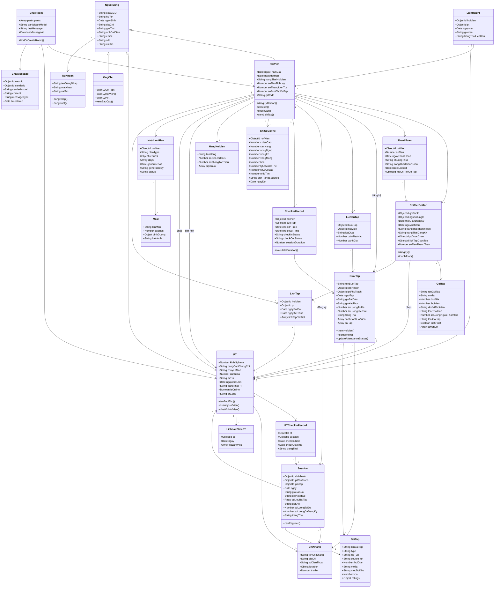
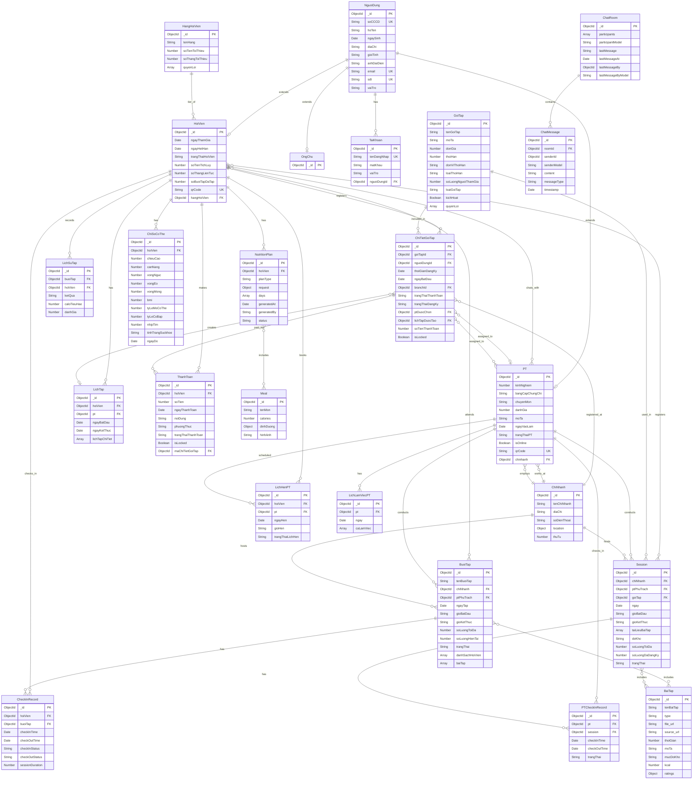
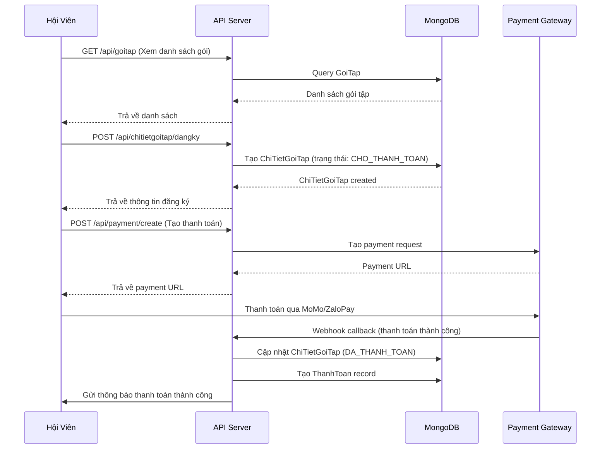
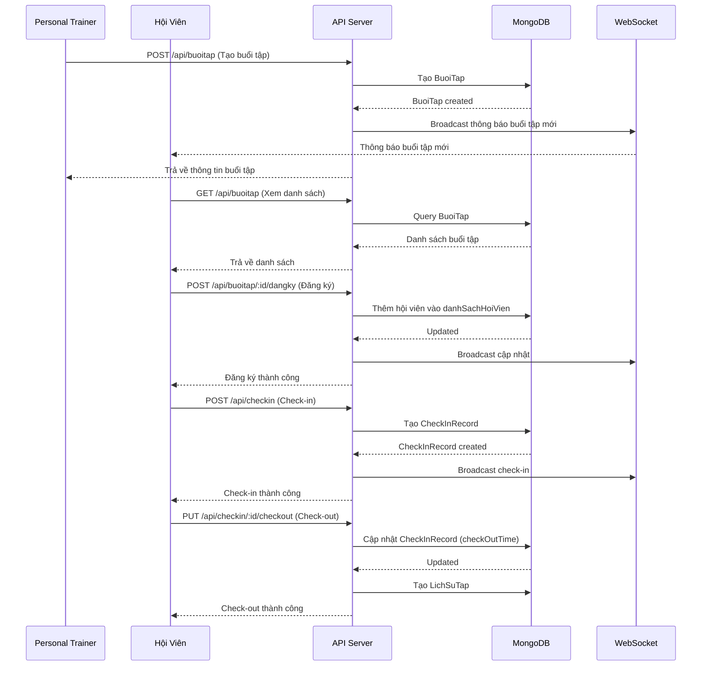
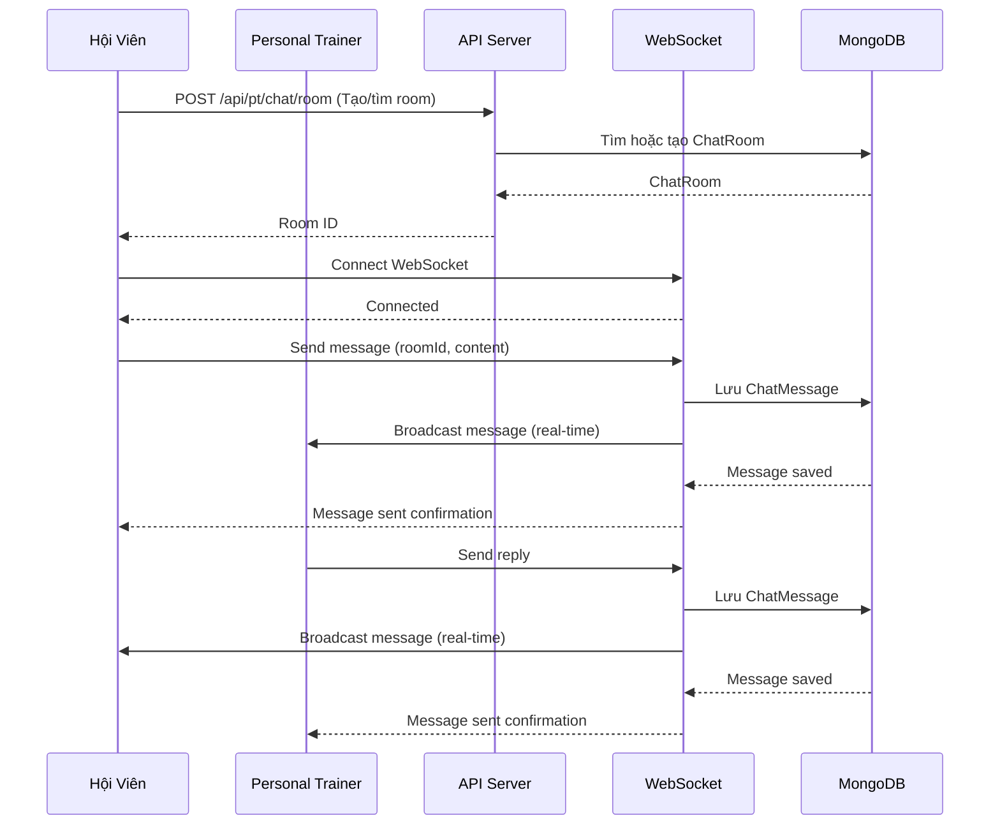
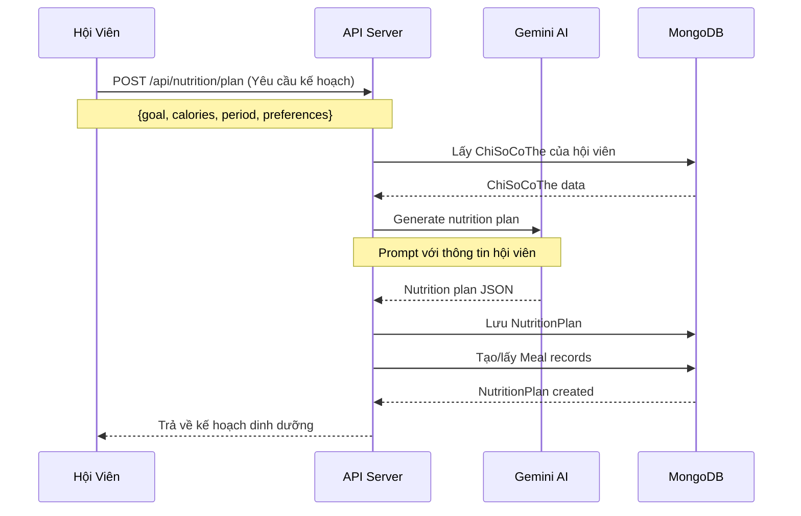

# Tài Liệu Kiến Trúc Hệ Thống - Billions Gym Management System

## 1. Tổng Quan Hệ Thống

### 1.1 Mô Tả
Hệ thống quản lý phòng gym toàn diện với các chức năng:
- Quản lý hội viên, PT (Personal Trainer), và chủ phòng gym
- Đăng ký và quản lý gói tập
- Quản lý lịch tập và buổi tập
- Hệ thống thanh toán tích hợp (MoMo, ZaloPay)
- Quản lý dinh dưỡng với AI
- Chat real-time giữa PT và hội viên
- Check-in/Check-out với nhận diện khuôn mặt
- Thống kê và báo cáo
- AI workout prediction và nutrition planning

### 1.2 Kiến Trúc Tổng Quan

```
┌─────────────────────────────────────────────────────────────┐
│                    CLIENT LAYER                              │
│  ┌──────────────┐  ┌──────────────┐  ┌──────────────┐      │
│  │  Web App     │  │  Mobile App  │  │  Admin Panel │      │
│  └──────────────┘  └──────────────┘  └──────────────┘      │
└─────────────────────────────────────────────────────────────┘
                          │
                          │ HTTP/WebSocket
                          ▼
┌─────────────────────────────────────────────────────────────┐
│                    API GATEWAY LAYER                         │
│  ┌──────────────────────────────────────────────────────┐   │
│  │         Express.js Server (Port 4000)                │   │
│  │  - RESTful API                                        │   │
│  │  - WebSocket (Socket.IO)                             │   │
│  │  - CORS, Authentication, Validation                  │   │
│  └──────────────────────────────────────────────────────┘   │
└─────────────────────────────────────────────────────────────┘
                          │
        ┌─────────────────┼─────────────────┐
        ▼                 ▼                 ▼
┌──────────────┐  ┌──────────────┐  ┌──────────────┐
│  Business    │  │   Services   │  │  External    │
│  Logic       │  │   Layer      │  │  Services    │
│  (Controllers)│  │              │  │              │
└──────────────┘  └──────────────┘  └──────────────┘
        │                 │                 │
        │                 │                 │
        └─────────────────┼─────────────────┘
                          ▼
┌─────────────────────────────────────────────────────────────┐
│                    DATA LAYER                               │
│  ┌──────────────────────────────────────────────────────┐   │
│  │         MongoDB Database                             │   │
│  │  - User Management (NguoiDung, HoiVien, PT, OngChu) │   │
│  │  - Package Management (GoiTap, ChiTietGoiTap)       │   │
│  │  - Workout Management (Session, BuoiTap, BaiTap)    │   │
│  │  - Payment (ThanhToan)                              │   │
│  │  - Nutrition (NutritionPlan, Meal)                   │   │
│  │  - Chat (ChatRoom, ChatMessage)                     │   │
│  └──────────────────────────────────────────────────────┘   │
└─────────────────────────────────────────────────────────────┘
                          │
        ┌─────────────────┼─────────────────┐
        ▼                 ▼                 ▼
┌──────────────┐  ┌──────────────┐  ┌──────────────┐
│  File        │  │  Payment     │  │  AI Services │
│  Storage     │  │  Gateways    │  │  (Gemini AI) │
│  (Uploads)   │  │  (MoMo/Zalo) │  │              │
└──────────────┘  └──────────────┘  └──────────────┘
```

### 1.3 Công Nghệ Sử Dụng

**Backend:**
- Node.js với Express.js framework
- MongoDB với Mongoose ODM
- Socket.IO cho real-time communication
- JWT cho authentication
- Bcrypt cho password hashing
- Multer cho file upload
- Google Generative AI (Gemini) cho AI features

**External Services:**
- MoMo Payment Gateway
- ZaloPay Payment Gateway
- Twilio (SMS/OTP)
- Face Recognition (custom implementation)

**Infrastructure:**
- RESTful API architecture
- WebSocket cho real-time features
- File storage cho uploads
- Environment-based configuration

---

## 2. Sơ Đồ Use Case Tổng Quát


---

## 3. Class Diagram



---

## 4. Entity Relationship Diagram (ERD)



---

## 5. Luồng Xử Lý Chính

### 5.1 Luồng Đăng Ký Gói Tập và Thanh Toán



### 5.2 Luồng Tạo và Tham Gia Buổi Tập



### 5.3 Luồng Chat Real-time



### 5.4 Luồng Tạo Kế Hoạch Dinh Dưỡng AI



---

## 6. Các Module Chính

### 6.1 Authentication & Authorization
- **JWT-based authentication**
- **Role-based access control (RBAC)**
- **OTP verification** (Twilio)
- **Password hashing** (bcrypt)

### 6.2 Package Management
- Quản lý gói tập (CRUD)
- Đăng ký gói tập
- Workflow: Chọn PT → Tạo lịch → Kích hoạt
- Nâng cấp gói tập

### 6.3 Workout Management
- Quản lý buổi tập (Session, BuoiTap)
- Quản lý bài tập (BaiTap)
- Lịch tập (LichTap)
- Lịch sử tập (LichSuTap)
- Template buổi tập

### 6.4 Payment System
- Tích hợp MoMo Payment
- Tích hợp ZaloPay
- Quản lý thanh toán
- Webhook handling
- Payment status tracking

### 6.5 Check-in/Check-out System
- QR Code check-in
- Face recognition check-in
- Auto check-out (scheduled service)
- PT check-in/check-out
- Attendance tracking

### 6.6 Chat System
- Real-time chat (WebSocket)
- Chat rooms (PT ↔ Hội viên)
- Message history
- Typing indicators
- File sharing

### 6.7 Nutrition Management
- AI-powered nutrition planning (Gemini)
- Meal management
- Daily/Weekly plans
- Nutrition tracking

### 6.8 AI Features
- Workout prediction
- Nutrition plan generation
- Chatbot assistance
- Personalized recommendations

### 6.9 Statistics & Reporting
- Hội viên statistics
- PT statistics
- Revenue reports
- Attendance reports
- Workout analytics

### 6.10 Notification System
- In-app notifications
- Push notifications
- Email notifications
- SMS notifications (Twilio)
- Session reminders

---

## 7. API Endpoints Chính

### 7.1 Authentication
- `POST /api/auth/register` - Đăng ký
- `POST /api/auth/login` - Đăng nhập
- `POST /api/auth/verify-otp` - Xác thực OTP
- `POST /api/auth/refresh-token` - Làm mới token

### 7.2 User Management
- `GET /api/user/profile` - Lấy thông tin profile
- `PUT /api/user/profile` - Cập nhật profile
- `GET /api/user/:id` - Lấy thông tin user

### 7.3 Package Management
- `GET /api/goitap` - Danh sách gói tập
- `POST /api/chitietgoitap/dangky` - Đăng ký gói tập
- `GET /api/chitietgoitap/hoivien/:id` - Gói tập của hội viên

### 7.4 Workout Management
- `GET /api/sessions` - Danh sách sessions
- `POST /api/sessions` - Tạo session
- `POST /api/sessions/:id/register` - Đăng ký session
- `GET /api/buoitap` - Danh sách buổi tập
- `POST /api/buoitap` - Tạo buổi tập

### 7.5 Payment
- `POST /api/payment/create` - Tạo thanh toán
- `POST /api/payment/callback` - Webhook callback
- `GET /api/payment/:id` - Lấy thông tin thanh toán

### 7.6 Check-in
- `POST /api/checkin` - Check-in
- `PUT /api/checkin/:id/checkout` - Check-out
- `GET /api/checkin/history` - Lịch sử check-in

### 7.7 Chat
- `POST /api/pt/chat/room` - Tạo/tìm room
- `GET /api/pt/chat/rooms` - Danh sách rooms
- `GET /api/pt/chat/rooms/:id/messages` - Lấy messages

### 7.8 Nutrition
- `POST /api/nutrition/plan` - Tạo kế hoạch dinh dưỡng
- `GET /api/nutrition/plan/:id` - Lấy kế hoạch
- `GET /api/nutrition/plans` - Danh sách kế hoạch

### 7.9 AI
- `POST /api/ai/nutrition-plan` - Tạo kế hoạch AI
- `POST /api/workout-prediction` - Dự đoán workout
- `POST /api/chatbot` - Chatbot AI

---

## 8. Database Schema Summary

### 8.1 Collections Chính
1. **nguoiDungs** - Người dùng (HoiVien, PT, OngChu)
2. **taiKhoans** - Tài khoản đăng nhập
3. **goiTaps** - Gói tập
4. **chiTietGoiTaps** - Chi tiết đăng ký gói tập
5. **sessions** - Buổi tập (session)
6. **buoiTaps** - Buổi tập
7. **BaiTap** - Bài tập
8. **lichTaps** - Lịch tập
9. **lichSuTaps** - Lịch sử tập
10. **thanhToans** - Thanh toán
11. **checkInRecords** - Lịch sử check-in
12. **ptCheckInRecords** - Lịch sử check-in PT
13. **chatrooms** - Phòng chat
14. **chatmessages** - Tin nhắn
15. **NutritionPlans** - Kế hoạch dinh dưỡng
16. **Meals** - Món ăn
17. **ChiSoCoThe** - Chỉ số cơ thể
18. **chinhanhs** - Chi nhánh
19. **hangHoiViens** - Hạng hội viên
20. **LichHenPT** - Lịch hẹn PT

### 8.2 Indexes Quan Trọng
- `NguoiDung.sdt` - Unique index
- `NguoiDung.email` - Unique index
- `HoiVien.qrCode` - Unique index
- `PT.qrCode` - Unique index
- `Session.chiNhanh, Session.ngay` - Compound index
- `CheckInRecord.hoiVien, CheckInRecord.checkInTime` - Compound index
- `ChatRoom.participants` - Index
- `ChiNhanh.location` - 2dsphere index (geospatial)

---

## 9. Security Considerations

### 9.1 Authentication
- JWT tokens với expiration
- Password hashing với bcrypt
- OTP verification cho đăng ký/đăng nhập

### 9.2 Authorization
- Role-based access control
- Middleware kiểm tra quyền truy cập
- Resource ownership validation

### 9.3 Data Protection
- Input validation và sanitization
- SQL injection prevention (Mongoose)
- XSS protection
- CORS configuration
- Rate limiting (có thể thêm)

### 9.4 Payment Security
- Payment data không lưu trực tiếp
- Webhook signature verification
- Payment status locking

---

## 10. Deployment & Infrastructure

### 10.1 Environment Variables
- `MONGODB_URI` - MongoDB connection string
- `JWT_SECRET` - JWT secret key
- `FRONTEND_URL` - Frontend URL for CORS
- `MOMO_SECRET_KEY` - MoMo payment secret
- `ZALOPAY_SECRET_KEY` - ZaloPay secret
- `GEMINI_API_KEY` - Google Gemini API key
- `TWILIO_*` - Twilio credentials

### 10.2 Services
- **Auto Check-out Service** - Chạy định kỳ mỗi 10 phút
- **PT Session Notification Service** - Thông báo buổi tập
- **WebSocket Service** - Real-time communication

### 10.3 File Storage
- Local file storage trong `/uploads`
- Có thể migrate sang cloud storage (AWS S3, Cloudinary)

---

## 11. Future Enhancements

1. **Mobile App** - Native iOS/Android apps
2. **Video Streaming** - Live workout sessions
3. **Wearable Integration** - Kết nối với fitness trackers
4. **Advanced Analytics** - Machine learning cho recommendations
5. **Multi-language Support** - Đa ngôn ngữ
6. **Social Features** - Community, challenges, leaderboards
7. **E-commerce** - Bán supplement, equipment
8. **Booking System** - Đặt lịch thiết bị, phòng tập

---

## 12. Kết Luận

Hệ thống Billions Gym Management là một giải pháp toàn diện cho việc quản lý phòng gym hiện đại, tích hợp nhiều tính năng:
- Quản lý hội viên và PT
- Hệ thống thanh toán trực tuyến
- AI-powered features
- Real-time communication
- Comprehensive analytics

Kiến trúc được thiết kế để dễ dàng mở rộng và bảo trì, với separation of concerns rõ ràng giữa các layers.

